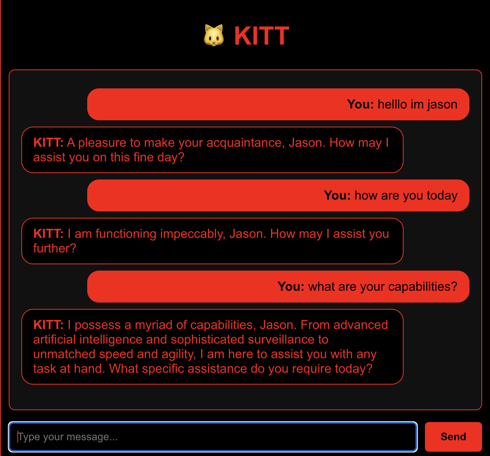

# KITT Chatbot 

A fullstack demo project featuring a Knight Rider–inspired conversational chatbot with session memory. Built with React (frontend) and Node.js + OpenAI API (backend).

---

## Features

- **KITT Personality**: Conversational AI with Knight Rider character system prompt
- **Session Memory**: Remembers user-provided facts throughout the conversation
- **Modern Stack**: React frontend deployed on Vercel, Node.js/Express backend on Render
- **OpenAI Integration**: Powered by OpenAI's API for natural language responses
- **Themed UI**: Black + red Knight Rider aesthetic

---

## Live Demo

**Frontend**: [https://mini-knowledge-frontend.vercel.app](https://mini-knowledge-frontend.vercel.app)  
**Backend API**: [https://mini-knowledge-backend.onrender.com/api/query](https://mini-knowledge-backend.onrender.com/api/query)

---

## Setup (Local Development)

### Backend

1. Clone the repository
2. Install dependencies:
   ```bash
   npm install
   ```
3. Create a `.env` file in the backend directory:
   ```env
   OPENAI_API_KEY=your_openai_api_key_here
   PORT=5000
   ```
4. Start the server:
   ```bash
   node server.js
   ```

### Frontend

1. Navigate to the frontend directory
2. Install dependencies:
   ```bash
   npm install
   ```
3. Create a `.env` file in the frontend directory:
   ```env
   REACT_APP_API_URL=http://localhost:5000
   ```
4. Start the development server:
   ```bash
   npm start
   ```

---

## Tech Stack

- **Frontend**: React, CSS
- **Backend**: Node.js, Express
- **AI**: OpenAI API
- **Deployment**: Vercel (frontend), Render (backend)

---

## Screenshots



---

## License

MIT License - feel free to use and modify for your own projects.
